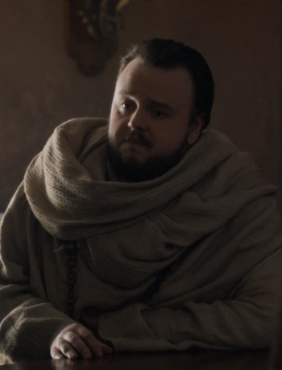

```{r setup, include=FALSE}
knitr::opts_chunk$set(echo = TRUE)
```


## Name : Samwell Tarly

```{r pressure, echo=FALSE, fig.cap="A caption", out.width = '10%'}

```

## Born: The Reach

## Interest: Dragon Glass research

## Bio:
# Samwell Tarly is the oldest son and former heir of Lord Randyll Tarly, the head of House Tarly and Lord of Horn Hill. House Tarly is one of the most powerful noble families in the Reach, and sworn to House Tyrell. By rights, Samwell would have grown up to be one of the top ranking lords of the Seven Kingdoms.